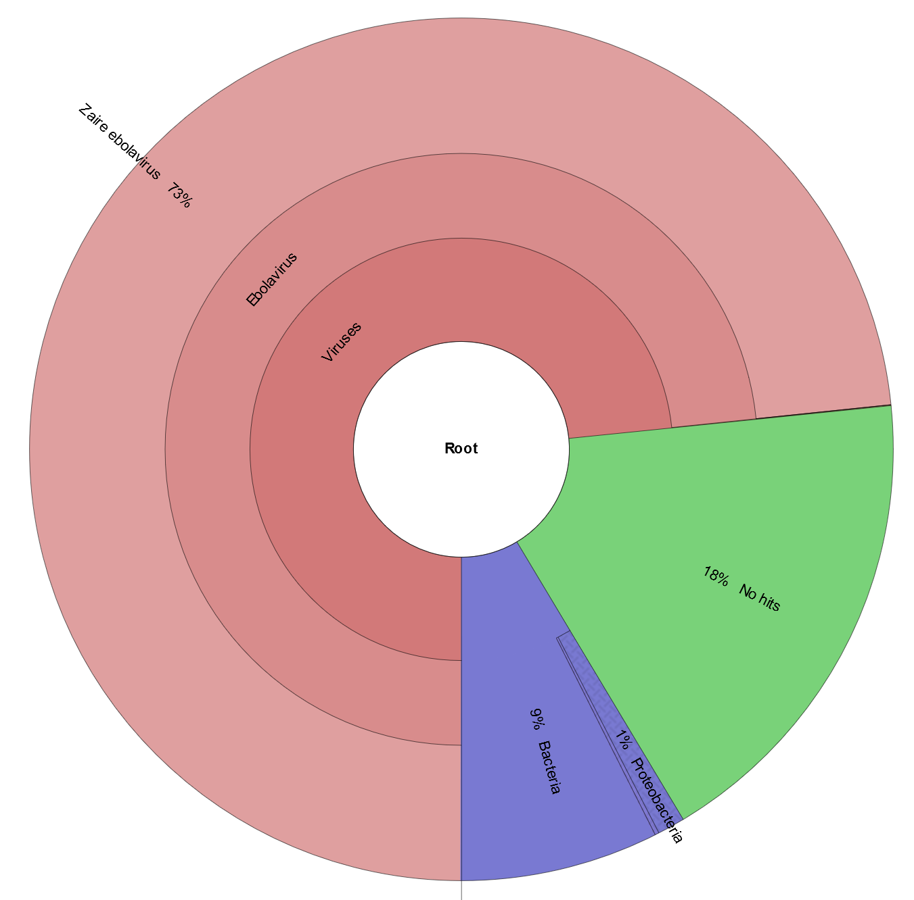

## Table of contents
1. [Introduction](#intro)
2. [Software](#software)    
2. [Environment Setup](#env)
3. [Exercise 1](#ex1)
4. [Exercise 2](#ex2)
5. [Exercise 3](#ex3)
6. [Paper](#paper)

<a name="intro"></a>
## Introduction

This tutorial aims to introduce a variety of softwares and concepts related to how to detect emerging pathogens from a complex host sample. Each exercise will demonstrate some of the concepts in current routine use and hopefully be applied to future applications.

All datasets have been modified to either illustrate a specific learning objective or to reduce the complexity of the problem. Contamination and a lack of large and accurate databases render detection of microbial pathogens difficult. As a disclaimer, all results produced from the tools described in this tutorial and others must also be verified with supplementary bioinformatics or wet-laboratory techniques.

<a name="software"></a>
## List of software for tutorial

* [Kraken](https://ccb.jhu.edu/software/kraken/)
* [KAT](https://kat.readthedocs.io/en/latest/)
* [Krona](https://github.com/marbl/Krona/wiki)
* [SPAdes](http://cab.spbu.ru/software/spades/)
* [NCBI blast](https://blast.ncbi.nlm.nih.gov/Blast.cgi?PAGE_TYPE=BlastSearch)
 
To begin, we will setup our environment in our ~/workspace so we can view our progress using the web browser.

<a name="env"></a>
## Environment setup

```bash
export WORK_DIR=~/workspace/module6/

mkdir -p $WORK_DIR

cd $WORK_DIR

ln -s ~/CourseData/IDGE_data/EPD_IMS .

mkdir $WORK_DIR/ex1 $WORK_DIR/ex2 $WORK_DIR/ex3

```

<a name="ex1"></a>
## Exercise 1

### Patient Background:

On April 27, a 66-year old male was admitted to a local ER. He presented with fever, headache, and vomiting but soon after admission to the ER presented with internal bleeding. CBC revealed elevated white blood cell count, neutrophils, etc. The hospital epidemiologist was consulted to confirm the clinician's findings. 

### Demonstration:

* Filter host reads with KAT
* Run Kraken with mini kraken database from RefSeq
* Generate text and graphic reports with Kraken and Krona

---

### Step 1: Host read filtering

The first step in this demonstration is to remove the host reads from the dataset prior to downstream analysis. There are several different tools that can be used to filter out host reads such as Kraken, BLAST, KAT and others. In this demonstration, we have selected KAT because of the smaller memory requirement compared to Kraken and relatively quick speed.

Command documentation is available [here](http://kat.readthedocs.io/en/latest/using.html#sequence-filtering)

KAT works by breaking down each read into k-mers fragments of length 27 and comparing them to a k-mer database of human reference genomes. Subsequently, the complete read is either assigned into a matched or unmatched file(s) if 10% of the k-mers in the read have been found in the human database. 

  

```bash
cd ex1

kat filter seq -i -o unmatched --seq ex1_1.fastq --seq2 ex1_2.fastq ../../kat_db/human_kmers.jf
```

#### Command arguments:

* `--seq --seq2` arguments to provide corresponding forward and reverse fastq reads
* `-i` whether to output sequences not found in the kmer hash, rather than those with a database hit (host sequences). 
* `-o unmatched` Provide prefix for all files generated by the command. In our case, we will have two output files **unmatched.in.R1.fastq** and **unmatched.in.R2.fastq**.

After the above command is done running, you should see similar output on your screen as shown below.

If the command was successful, your current directory should contain two new files:

* unmatched.in.R1.fastq
* unmatched.in.R2.fastq

---

### Step 2: Classify reads against kraken database

Now that we have most, if not all, host reads filtered out, it’s time to classify the remaining reads.

Database selection is one of the most crucial parts of running Kraken. One of the many factors that must be considered are the computational resources available. Our current AWS image for the course has only 16G of memory. A major disadvantage of Kraken is that it loads the entire database into memory. With the full viral, bacterial, and archael database on the order of 100 GB we would be unable to run Kraken on the course machine (though the recently released Kraken 2 has done a lot to reduce database size). To help mitigate this, Kraken allows reduced databases to be constructed, which will still give reasonable results. We have constructed our own miniture Kraken database for this course, though a downloadable version is also provided by the authors: [minikraken](https://ccb.jhu.edu/software/kraken/dl/minikraken.tgz).

Lets run the following command in our current directory to classify our reads against the minikraken database.

```bash
kraken --paired --threads 4 --db ../../module_data/kraken_db/ unmatched.in.R1.fastq unmatched.in.R2.fastq > results_initial.txt
```

After the above command is done running, you should see similar output on your screen as shown below.

```
110056 sequences (32.66 Mbp) processed in 13.748s (480.3 Kseq/m, 142.53 Mbp/m).
  90212 sequences classified (81.97%)
  19844 sequences unclassified (18.03%)
```

---

### Step 3: Generate text-based report using Kraken-report.

While this initial output file, `results_initial.txt`, is useful as input to some software, it is not really meant to be human readable. Lets convert this file to a human-readable format using `kraken-report`.

```bash
kraken-report --db ../../module_data/kraken_db/ results_initial.txt > results_final.txt
```

Let’s look at the generated text report from Kraken-report by opening a web browser on your laptop, and navigate to http://cbwXX.dyndns.info/, where XX is your student ID. You should be able to find the file in the following directory hierarchy `~/workspace/modules6/ex1/` and open file `final_report.txt`

The output of `kraken-report` is easier to understand and interpret than the previous output we generated from Kraken, but it is still not as interactive as it could be. Documentation for kraken-report is available [here](https://ccb.jhu.edu/software/kraken/MANUAL.html#sample-reports)

This is where Krona comes in. Krona generates an interactive html web page that allows hierarchical data to be explored with zooming, multi-layered pie charts and other added features.

---
### Step 4: Generate interactive html based report using Kraken-report.

```bash
cut -f2,3 results_initial.txt > krona_input.txt

ktImportTaxonomy krona_input.txt -o final_web_report.html
```

Let’s look at what Krona generated.

Return to your web browser and refresh the page from Step 3 to see the new files added in ~/workspace/modules6/ex1 directory.

Click on final_web_report.html and you should see the image below.



---
### Questions

1. Given the output of Krona, what do you hypothesize is causing the patient's illness?

---
<a name="ex2"></a>
## Exercise 2


### Background:

On April 24, a 5-year old female was admitted to a local ER. She presented with high fever, chills and enlarged lymph nodes. CBC revealed elevated white blood cell count, neutrophils, etc. The hospital epidemiologist was consulted to confirm the clinician's’ findings. 


### Demonstration:

* Filter host reads with KAT
* Run Kraken with specific bacterial and viral databases
* Generate text and graphic reports with Kraken and Kronatools


---
### Step 1: Host read filtering

The first step in this demonstration is to remove the host reads from the dataset prior to downstream analyses.


```bash
cd ~/workspace/module6/ex2/

kat filter seq -i -o unmatched --seq ../EPD_IMS/reads/ex2/ex2_R1.fastq --seq2 ../EPD_IMS/reads/ex2/ex2_R2.fastq ../EPD_IMS/kat_db/human_kmers.jf

```

---
### Step 2: Classify reads against bacterial kraken database

In the previous example, we were introduced to minikraken. Recall, minikraken is a smaller database that includes a subset of complete bacterial, archaeal and viral genomes in RefSeq. In the following example, we will be using multiple, larger databases to increase our confidence that the database(s) we use will be able to detect the microbial pathogen sequences present in our sample.


We will be using a parallel analysis pipeline in this approach as shown in the image below.


In the following exercise, we will run through both bacterial and viral databases, starting with the bacterial database.


```bash
kraken --paired --threads 4 --db  ../EPD_IMS/kraken_db/bacterial unmatched.in.R1.fastq  unmatched.in.R2.fastq  > results_bacterial.txt

kraken-report  --db ../EPD_IMS/kraken_db/bacterial results_bacterial.txt > bacterial_report.txt

```


Let’s open up the file ~/workspace/modules6/ex2/bacterial_report.txt in the web browser to visualize the results.

Looks like all the reads were marked as unclassified. One logical answer would be that our microbial pathogen of interest is not present in our database. Since we ran our reads against a bacterial database, perhaps we should try the viral one next.


---
### Step 3: Classify reads against viral kraken database


Please note that we are running these commands on the reads generated from KAT and not output from the previous Kraken run. These are independent but parallel runs on the **same** data from KAT.

```bash
kraken --paired --threads 4 --db  ../EPD_IMS/kraken_db/viral unmatched.in.R1.fastq  unmatched.in.R2.fastq  > results_viral.txt

kraken-report  --db ../EPD_IMS/kraken_db/viral results_viral.txt > viral_report.txt

```

Open the file ~/workspace/modules6/ex2/viral_report.txt in your web browser to view the result. Looks like a large amount of our reads matched to the Orthopoxvirus genus; though we could not detect a species.


### Questions

1) What microbe has caused the infection?

2) What advantages and disadvantages can you foresee when using the parallel analysis pipeline approach?

3) Using the viral_report, can you indicate with absolute certainty which species is our etiological culprit? Explain why or why not?


---
<a name="ex3"></a>
## Exercise 3


### Background:

On January 13th, a 78-year old male patient was rushed to the hospital from a long term care facility and died shortly upon arrival. Prior to the patient passing away, he was experiencing a high fever and shortness of breath. The patient’s medical history indicated he had multiple chronic illnesses for several years.


### Demonstration:


* Filter host reads with KAT
* Run Kraken with bacterial and viral databases
* Extract unclassified reads from Kraken
* Generate an assembly using SPAdes
* BLAST contigs against NCBI nt database


---
### Step 1: Host read filtering

Same instruction as listed in Exercise 1, Step 1 but using dataset found in ex3 folder.


```bash

cd ~/workspace/module6/ex3/

kat filter seq -i -o unmatched --seq ../EPD_IMS/reads/ex3/ex3_R1.fastq --seq2 ../EPD_IMS/reads/ex3/ex3_R2.fastq  ../EPD_IMS/kat_db/human_kmers.jf


```

---
### Step 2: Classify reads against bacterial database


In the previous example, we used the parallel analysis approach to find the microbe in question.  In the following exercise, we will be using a serial analysis pipeline .


As we are performing a serial analysis, each step will utilize unclassified reads from the previous step rather than from the reads that did not match the host reads. A disadvantage of Kraken when outputting unclassified reads is that the quality values are lost when the user provides both forward and reverse fastq files as input. Hence, to keep Kraken from losing these quality values, we will combine our forward and reverse reads together thus treating them as a single-end reads.


```bash
cat unmatched.in.R1.fastq unmatched.in.R2.fastq > unmatched.fastq

kraken --threads 4 --db  ../EPD_IMS/kraken_db/bacterial unmatched.fastq  --unclassified-out unclassified_bact_reads.fastq > results_bacterial.txt

kraken-report  --db ../EPD_IMS/kraken_db/bacterial results_bacterial.txt > bacterial_report.txt

```

```--unclassified-out``` print unclassified sequences to filename

Taking a look at our bacterial_report.txt using the web browser, we can see that nothing matched the database. Next, we will attempt to classify the ‘unclassified’ reads from the previous Kraken analysis against the viral database.


---
### Step 3: Classify reads against the viral kraken database

Now attempt to run the viral database on the same output from unclassified reads from kraken bacterial.

```bash
kraken --threads 4 --db  ../EPD_IMS/kraken_db/viral  unclassified_bact_reads.fastq --unclassified-out unknown.fastq  > results_viral.txt

kraken-report  --db ../EPD_IMS/kraken_db/viral results_viral.txt > viral_report.txt

```


Open the viral_report.txt and scan the report to see if any reads were classified.

The report reveals that everything is unclassified again. Since we have been propagating our reads through the different Kraken databases (e.g. bacterial and viral), our next option to detect the microbe in question is to take all of the unclassified reads and assemble them using SPAdes.


---
### Step 4: Generate an assembly with unclassified reads

We will be using default parameters for SPAdes.

More in-depth documentation can be found [here](http://cab.spbu.ru/files/release3.10.1/manual.html).


```bash

spades.py  -s unknown.fastq -o assembly_results


```

Note: it may take a few minutes for SPAdes to run to completion.  


SPAdes has many different output files that are self-contained in a single directory. For now, we are only interested in the assembly_results/contigs.fasta.

For a quick search to see what has assembled, we will view the first 10 lines of the largest contig (which happens to be the top fasta entry in contigs.fasta) and do a BLAST on the NCBI server.

---
### Step 4: BLAST partial contig(s) against NT database

Blast the subset of the top contig against NCBI's nt database online

```bash

head -n 10 assembly_results/contigs.fasta

>NODE_1_length_8957_cov_2.90725
TAACTATGATGATCTTTTTGATGGAAACCATGAAGGTAATATTGAATCCATTTTTGAAGC
GAATGGTGAAGGCTGGGGATCTACAATCGGAGCATGGGGAACATCAATGTTTTACGGAAC
CGACTGGAAAAAGTTTAATACACCGGCTAATGCTTTAGTTAAAGCTTATGATGATGAAAA
AGATACGGTGAGAAAAAAATCTACAGTATGGTTCTCTGATAAAACCGTTTCATGGTCCGA
TACGTATTGGCCGTCATCTAATTTTCCGTTTGCCTATAAGATGAGAAAAACGGATGGTAC
ACAGAATTTTTATATTTTCAGATTGTCTGATATTTTATTATTGAAGGCAGAAGCGCAGGC
ACAAACGGGAGACCTCGCCGGTGCTGCGGTAAATGTTAATAAGATAAGAACAAGAGCAGC
ACTATCACCTGTTGCTTTCGCGACGAAGGCAGACGCAATTGATAAAATCCTAAAAGAACG
TTATCTGGAGCTTGCATTTGAGGGGCATCGTTGGTTTGATCTGAAAAGAACAGGGAAGTC


```


Navigate to [NCBI Blast](https://blast.ncbi.nlm.nih.gov/Blast.cgi?PAGE_TYPE=BlastSearch) in your web browser and copy & paste the partial fasta contig into "Enter Query Sequence" textbox. From there, click on the BLAST button.


### Questions

1) What species is being reported in BLAST? Is this our potential microbial pathogen of interest?


2) What advantages and disadvantages can you foresee when using the serial analysis pipeline approach?

3) With the viral_report, can you indicate with absolute certainty which species is our etiological culprit? Why or why not?

4) Why do you think we used SPAdes instead of metaSPAdes? Try it out on the server. (hint : metaspades.py is the tool name)


## Paper

<a name="paper"></a>
[An evaluation of the accuracy and speed of metagenome analysis tools](https://www.nature.com/articles/srep19233)
